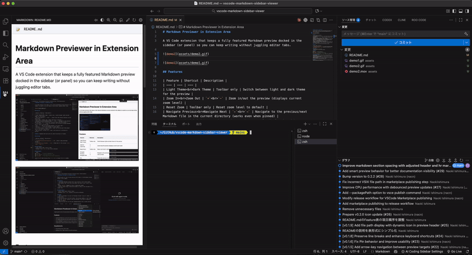
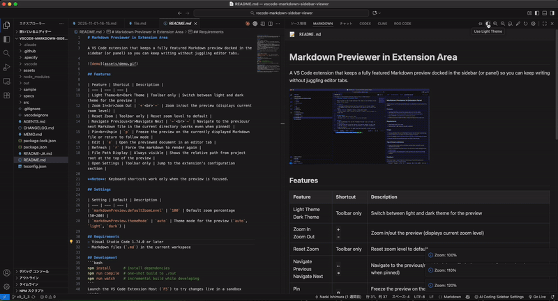

# Markdown Previewer in Extension Area

[](https://marketplace.visualstudio.com/items?itemName=nacn.markdown-previewer-in-extension-panel) [](https://code.visualstudio.com/) [](https://marketplace.visualstudio.com/items?itemName=nacn.markdown-previewer-in-extension-panel)

[English](README.md) | 日本語 | [한국어](README-KO.md) | [简体中文](README-ZH-CN.md) | [繁體中文](README-ZH-TW.md) | [Português (BR)](README-PT-BR.md)

拡張機能エリア（プライマリサイドバー、セカンダリサイドバー、またはパネル）にフル機能の Markdown プレビューを表示し、エディタタブを行き来することなくドキュメントを閲覧・ナビゲートできる VS Code 拡張機能です。

## 機能

### 🎯 拡張機能エリアへの表示

プライマリサイドバー、セカンダリサイドバー、またはパネルに表示できます。



| 機能 | ショートカット | 説明 |
| --- | --- | --- |
| 前後のファイルへ移動 | `←` / `→` | 同じディレクトリ内の前後の Markdown ファイルに移動 |
| ピン留め/解除 | `p` | 現在表示中の Markdown ファイルにプレビューを固定、または追従モードに戻る |
| 編集 | `e` | プレビュー中のドキュメントをエディタタブで開く |
| ファイルパスコピー | パスをクリック | ファイルパスをクリックしてクリップボードにコピー。VS Code の通知メッセージが表示される |
| 設定を開く | ツールバーのみ | 拡張機能の設定画面を開く |


### 🎨 リッチなプレビュー体験

快適に閲覧するための多彩な機能を提供します。



| 機能 | ショートカット | 説明 |
| --- | --- | --- |
| ライト/ダークテーマ | `t` | プレビューのライト/ダークテーマを切り替え |
| 拡大/縮小 | `+` / `-` | プレビューを拡大/縮小表示（現在のズームレベルを表示） |
| ズームリセット | `r` | ズームレベルを 100% にリセット |
| Mermaid 図 | 自動 | Mermaid 図（フローチャート、シーケンス図、クラス図など）をプレビュー内で直接レンダリング |
| Mermaid コピー | ホバーツールバー | Mermaid 図のソースコードを Markdown コードブロックとしてクリップボードにコピー |
| Mermaid 保存 | ホバーツールバー | VS Code の保存ダイアログを使って Mermaid 図を PNG 画像として保存 |
| シンタックスハイライト | 自動 | 言語を指定したフェンスコードブロックを言語に応じて色分け表示（例: <code>```javascript</code>） |
| コードブロックのコピー | ホバーツールバー | フェンスコードブロック全体をワンクリックでクリップボードにコピー |
| 選択テキストのコピー | `c` | 選択したテキストをクリップボードにコピー。VS Code の通知メッセージが表示される |
| 引用コピー | `q` | 選択したテキストの各行に `> ` を付けてコピー。Markdown での引用に便利 |
| ファイルパス表示 | 常時表示 | プレビュー上部にプロジェクトルートからの相対パスを表示 |
| テーマ対応スクロールバー | 自動 | スクロールバーがライト/ダークテーマに合わせて表示され、視認性が向上 |
| リンクの右クリックメニュー | リンクを右クリック | `http`/`https` リンクを標準ブラウザと VS Code 統合ブラウザ（Simple Browser）のどちらで開くか選択 |

### 🗂️ サイドバー機能

4つのタブ（アウトライン、ファイル、履歴、ヘルプ）でさまざまな情報を確認できます。

| タブ | ショートカット | 説明 |
| --- | --- | --- |
| サイドバー | `s` | アウトライン、ファイル、履歴、ヘルプのタブを持つサイドバーパネルを表示/非表示。Tab でタブ切り替え、↑/↓ で項目移動、Enter で選択、Esc で閉じる |
| アウトライン | `o` | サイドバーを開いてアウトラインタブを表示。現在のファイル名と h1-h6 のナビゲーションを表示。↑/↓ で移動、Enter で選択、Esc で閉じる |
| ファイル | `f` | サイドバーを開いてファイルリストタブを表示。同じディレクトリ内の Markdown ファイルを一覧表示してクイックナビゲーション。↑/↓ で移動、Enter で選択、Esc で閉じる |
| ファイルソート | `a` | ファイルの並び順を名前順（アルファベット順）と更新日時順（新しい順）で切り替え |
| 履歴 | `h` | サイドバーを開いて履歴タブを表示。最近プレビューしたファイルをクイックナビゲーション。↑/↓ で移動、Enter で選択、Esc で閉じる |
| ヘルプ | Tab キー | サイドバーのヘルプタブで全機能とキーボードショートカットを確認。サイドバー表示中に Tab キーでアクセス |

**注意**: キーボードショートカットはプレビューにフォーカスがある時のみ動作します。

## 設定項目

| 設定項目 | デフォルト値 | 説明 |
| --- | --- | --- |
| `markdownPreviewInExtensionPanel.defaultZoomLevel` | `100` | デフォルトのズーム率（50–200） |
| `markdownPreviewInExtensionPanel.themeMode` | `auto` | プレビューのテーマモード（`auto`, `light`, `dark`） |
| `markdownPreviewInExtensionPanel.fileSortOrder` | `name` | ファイルタブのファイルソート順（`name`, `modified`） |
| `markdownPreviewInExtensionPanel.scrollSync` | `true` | ソースエディタとプレビューのスクロールを同期（双方向）。ソースエディタがプレビューと同時に表示されている必要があります。 |

## 動作条件
- Visual Studio Code 1.74.0 以降
- 現在のワークスペース内にある Markdown ファイル（`.md`）

## 開発
```bash
npm install      # 依存関係のインストール
npm run compile  # ./out への単発ビルド
npm run watch    # 開発中の継続ビルド
npm test         # ユニットテストを実行
```
VS Code の拡張機能開発ホスト（`F5`）を起動すると、サンドボックスウィンドウで変更をすぐに確認できます。

## ヒントと既知の制限
- **サイドバー**: `s`キーでアウトライン、ファイル、履歴、ヘルプをタブで切り替えられるサイドバーパネルを表示/非表示にできます。Tab でタブ切り替え、↑/↓ で項目移動、Enter で選択、Esc で閉じることができます。
- **アウトライン**: `o`キーでサイドバーを開いてアウトラインタブを表示します。タブ上部に現在のファイル名が罫線付きで表示され、その下に Markdown ドキュメントから抽出した h1-h6 見出しがクリック可能なナビゲーションとして表示されます。
- **ファイルリスト**: `f`キーでサイドバーを開いてファイルリストタブを表示します。現在のファイルと同じディレクトリ内の全 Markdown ファイルを表示し、現在のファイルがハイライト表示されます。任意のファイルをクリックして切り替えることができます。`a`キーで名前順と更新日時順を切り替えられます。
- **履歴**: `h`キーでサイドバーを開いて履歴タブを表示します。最近プレビューした Markdown ファイルを時系列順（最新順）で表示します。任意のファイルをクリックして切り替えたり、Clear ボタンですべての履歴を削除できます。
- **ヘルプ**: サイドバーのヘルプタブでは、全機能とキーボードショートカットのクイックリファレンスを提供します。Tab キーでサイドバーのタブを巡回してアクセスできます。
- ファイルリストタブは、ディレクトリ内に2つ以上の Markdown ファイルがある場合にのみ表示されます。
- サイドバーが開いている時、↑/↓ で項目を移動、Enter で選択、Esc で閉じることができます。
- 左右矢印キー（←/→）は、サイドバーが開いている時でも常に前後の Markdown ファイルに移動します。
- Mermaid 図は jsDelivr CDN から読み込むため、オフライン環境では描画されません。
- 画像やリンクは VS Code のワークスペースパス解決を利用します。参照先ファイルが到達可能な場所に存在することを確認してください。
- Markdown ファイルが開かれていない場合、利用可能であればワークスペースの README.md を自動的に表示します。
- 非 Markdown ファイルに切り替えてもプレビューは継続されるため、コード作業中もドキュメントを表示し続けることができます。
- 別のファイルに切り替えてもサイドバーは表示されたままになり、ナビゲーションの状態が維持されます。
- 別の Markdown ファイルに切り替えた際、スクロール位置が自動的に最上部にリセットされ、新鮮な閲覧体験を提供します。
- 引用コピー機能は、Issue やプルリクエスト、その他の Markdown ドキュメントでコンテンツを引用する際に便利です。

## フィードバック
不具合報告や機能リクエストは GitHub Issues からお寄せください。スクリーンショットや簡潔な再現手順を添えていただけると対応がスムーズになります。
