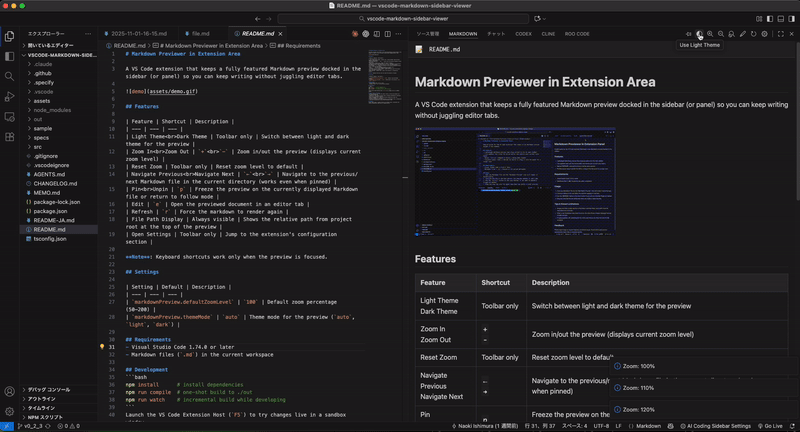
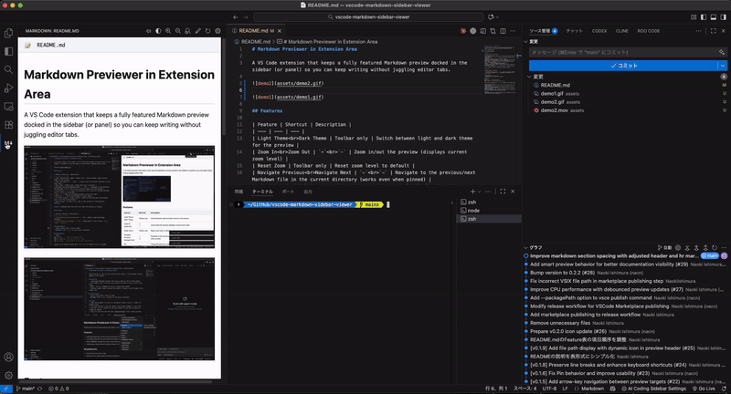

# Markdown Previewer in Extension Area

A VS Code extension that keeps a fully featured Markdown preview docked in the sidebar (or panel) so you can keep writing without juggling editor tabs.





## Features

| Feature | Shortcut | Description |
| --- | --- | --- |
| Headings | Hover to expand | Displays a navigation panel with h1-h3 headings in the document (located in the file path header, expands as dropdown on mouse hover) |
| Light Theme<br>Dark Theme | `t` | Switch between light and dark theme for the preview |
| Zoom In<br>Zoom Out | `+`<br>`-` | Zoom in/out the preview (displays current zoom level) |
| Reset Zoom | `r` | Reset zoom level to default |
| Navigate Previous<br>Navigate Next | `←`<br>`→` | Navigate to the previous/next Markdown file in the current directory (works even when pinned) |
| Pin<br>Unpin | `p` | Freeze the preview on the currently displayed Markdown file or return to follow mode |
| Edit | `e` | Open the previewed document in an editor tab |
| File Path Display | Always visible | Shows the relative path from project root at the top of the preview |
| Code Block Syntax Highlighting | Automatic | Adds language-aware coloring to fenced code blocks when you specify a language (for example, <code>```javascript</code>) |
| Code Block Copy Button | Hover toolbar | Copies the entire fenced code block to your clipboard with one click |
| Theme-Aware Scrollbars | Automatic | Scrollbars inside the preview now respect the active light/dark theme for better readability |
| Open Settings | Toolbar only | Jump to the extension's configuration section |

**Note**: Keyboard shortcuts work only when the preview is focused.

## Settings

| Setting | Default | Description |
| --- | --- | --- |
| `markdownPreview.defaultZoomLevel` | `100` | Default zoom percentage (50–200) |
| `markdownPreview.themeMode` | `auto` | Theme mode for the preview (`auto`, `light`, `dark`) |

## Requirements
- Visual Studio Code 1.74.0 or later
- Markdown files (`.md`) in the current workspace

## Development
```bash
npm install      # install dependencies
npm run compile  # one-shot build to ./out
npm run watch    # incremental build while developing
```
Launch the VS Code Extension Host (`F5`) to try changes live in a sandbox window.

## Tips & Known Limitations
- The Headings panel automatically extracts h1-h3 headings from your Markdown document and provides clickable navigation.
- The Headings panel is located in the file path header area at the top of the preview.
- Hover over the Headings title to expand the navigation dropdown menu.
- Clicking on a heading in the dropdown smoothly scrolls to that section in the preview.
- Mermaid diagrams load from the jsDelivr CDN; an offline environment will skip diagram rendering.
- Images and links resolve using VS Code's workspace paths—ensure referenced files exist in reachable locations.
- When no Markdown file is open, the preview automatically shows the workspace's README.md if available.
- The preview persists even when switching to non-Markdown files, allowing you to keep your documentation visible while working on code.
- When switching to a different Markdown file, the scroll position automatically resets to the top for a fresh viewing experience.

## Feedback
Please report bugs or request features via GitHub Issues. Screenshots and concise reproduction steps help us respond quickly.
