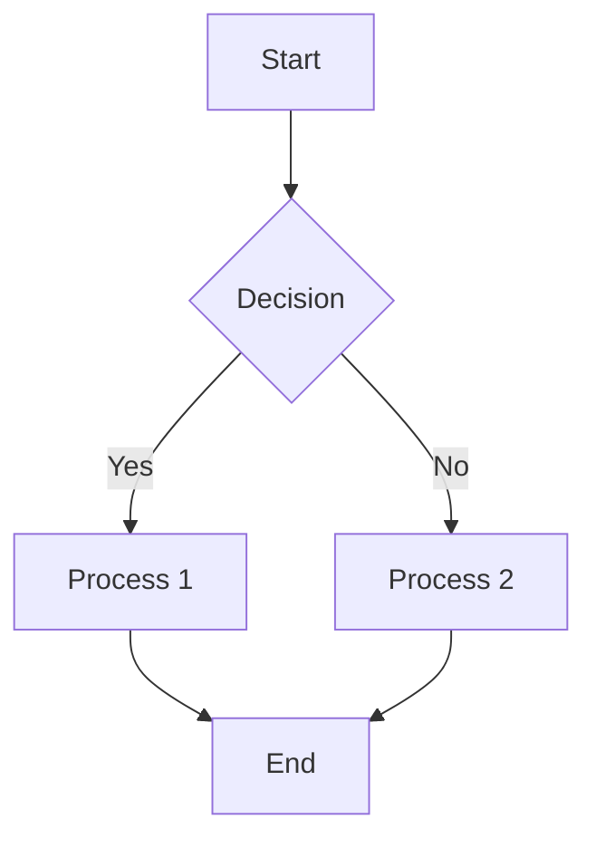
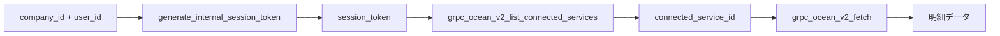
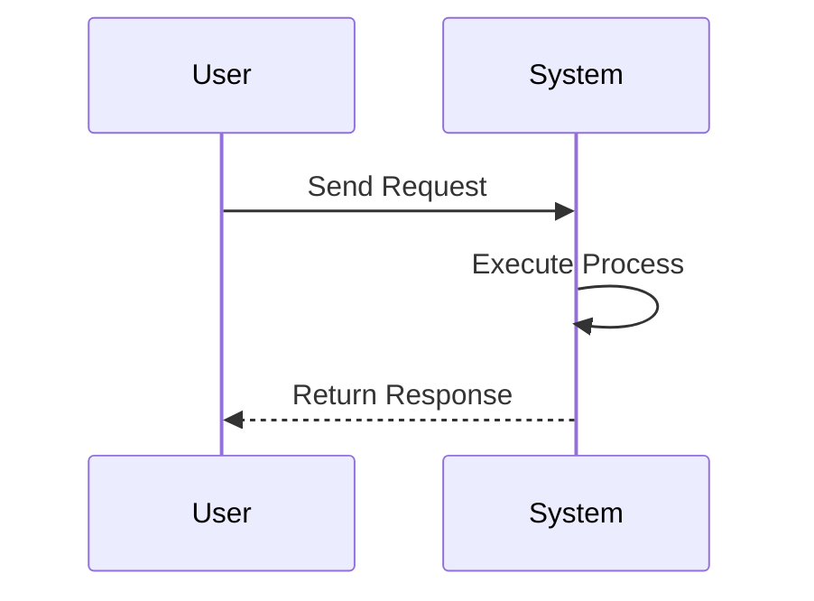
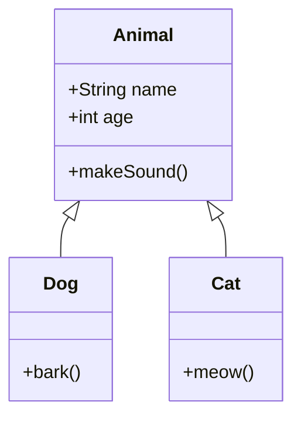

# Mermaid Test

This file is for testing Mermaid diagram rendering.

## Flowchart (TD: Top-Down)



## Flowchart (LR: Left-Right)



## Sequence Diagram



## Regular Code Block

This is a regular code block and should not be rendered as a diagram:

```javascript
function hello() {
    console.log("Hello World");
}
```

## Class Diagram



